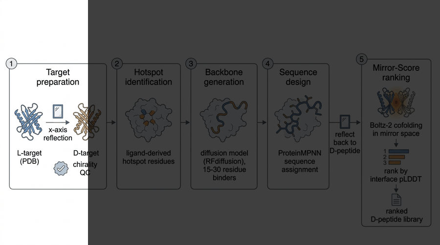

<div align="center">

[](https://arxiv.org/abs/2609.36057)
[](LICENSE)


**Official replication repository and dataset for the paper** [https://arxiv.org/abs/2609.36057]:

***"Mirror-Score: Calibrated, Inference-only Scoring Exposes the Limits of Sequence-compatibility Ranking in D-peptide Design"***

Jiada Li (Ph.D.) (2026)



</div>

---

# Mirror-Score

**Calibrated, inference-only scoring of D-peptide / L-protein binding — built on and beyond [Mirror-Peptidizer](https://github.com/dahuilangda/Mirror-Peptidizer).**

Mirror-Score is a lightweight computational pipeline that ranks heterochiral
(D-peptide : L-protein) complexes by predicted binding affinity. It combines
mirror-space ProteinMPNN sequence compatibility, structural interface
descriptors, and mirror-space structure-prediction confidence (Boltz-2) into a
calibrated score, evaluated on a curated benchmark of 31 D-peptide/L-protein
crystal complexes with literature-verified affinities.

## Attribution

This project builds directly on the **Mirror-Peptidizer** pipeline:

> Ma et al. *Mirror-Peptidizer: de novo design of D-peptides binding to
> therapeutic targets.* **Research** 2026;9:1420.
> DOI: [10.34133/research.1420](https://doi.org/10.34133/research.1420)
> Code: https://github.com/dahuilangda/Mirror-Peptidizer (Apache-2.0)

We thank the Mirror-Peptidizer authors for open-sourcing their pipeline,
including the vendored ProteinMPNN implementation, which Mirror-Score reuses
for mirror-space sequence-backbone compatibility scoring. Mirror-Score also
depends on [ProteinMPNN](https://github.com/dauparas/proteinmpnn)
(Dauparas et al. 2022) and [Boltz-2](https://github.com/jwohlwend/boltz).

## Gaps in Mirror-Peptidizer addressed by Mirror-Score

| # | Gap in Mirror-Peptidizer | Mirror-Score approach |
|---|--------------------------|----------------------|
| 1 | Ranking uses raw ProteinMPNN NLL (backbone-sequence compatibility), which is not a binding-energy proxy; only 4/9 designed MDM2 peptides bound experimentally | Multi-feature calibrated score (MPNN NLL + interface descriptors + Boltz-2 mirror-space confidence) validated against 18 literature affinities |
| 2 | No public benchmark of heterochiral complexes with affinities | Curated 31-complex D-peptide/L-protein benchmark (4 target families) with verified KD/IC50 values and provenance |
| 3 | No calibration or uncertainty: scores are uninterpretable numbers | Family-matched calibration with leave-one-out / leave-one-family-out evaluation; honest negative results reported |
| 4 | No transfer framework from the abundant L-peptide data | Family-matched L-peptide transfer set (PMI/p53/EEVD/TE33) linking L-space and mirror-space features |
| 5 | Design loop ends at sequence generation; no prospective ranking protocol | End-to-end prospective workflow: RFdiffusion backbones on mirrored targets → ProteinMPNN sequences → Mirror-Score ranking, demonstrated on AMR targets (LasR, LecB) |
| 6 | Chirality QC of mirrored structures not automated | Automated φ/ψ-inversion QC (`|φL+φD| ≈ 0`) for every mirrored structure |

## Pipeline

```
 target L-protein ──mirror──► D-form target
        │                          │
        │                    RFdiffusion (binder backbones)
        │                          │
        ▼                    ProteinMPNN (sequences)
 D-peptide candidates ──mirror──► L-form complexes
        │                          │
        ├── ProteinMPNN NLL (mirror space)
        ├── interface descriptors (contacts, H-bonds, charges)
        └── Boltz-2 confidence (mirror space: pTM, ipTM, pAE)
                   │
                   ▼
            Mirror-Score (calibrated) ──► ranked D-peptide library
```

## Repository layout

| Path | Contents |
|------|----------|
| `mirrorscore/` | Python package: `mirror.py` (x-axis reflection + chirality QC), `features.py` (interface descriptors), `mpnn_score.py` (ProteinMPNN mirror-space NLL) |
| `data/benchmark/` | 31 heterochiral complexes, structures, descriptors, calibration table |
| `data/transfer_set/` | Family-matched L-peptide KD set |
| `data/amr_targets/` | Mirrored AMR targets (LasR, LecB) + RFdiffusion inputs |
| `docs/` | Methods detail, benchmark provenance, prospective design protocol |
| `examples/` | Worked example: MDM2 D-peptide series |
| `figures/` | Benchmark and calibration figures |
| `scripts/` | Batch feature extraction and candidate ranking |

## Key results (calibration, n = 10 with Boltz-2 features)

On the complete viral-entry family (7 crystal structures, but only **3 distinct
peptides** — PIE7 x2 at 620 nM, PIE12 x4 at 37 nM, PIE71 x1 at 410 nM — so
structure-level statistics overstate the evidence):

| Feature / model | Structure-level LOO rho (n=7) | Peptide-level rho (n=3) |
|---|---|---|
| ProteinMPNN NLL (Mirror-Peptidizer's ranker) | +0.18 | -0.50 |
| Interface contacts + H-bonds + hydrophobic fraction | +0.84 | — |
| **Boltz-2 interface pLDDT (mirror space)** | **+0.90** | **-1.00 (perfect monotonic ordering)** |

At the peptide level, Boltz-2 interface pLDDT orders all three peptides
correctly (PIE12 > PIE71 > PIE7), while NLL does not; with n = 3 peptides this
is directional consistency, not statistical significance. Raw MPNN NLL not
only fails but **sign-flips between families** (MDM2/CHIP rho = +0.62 vs gp41
rho = -0.70), explaining Mirror-Peptidizer's 4/9 experimental hit rate.
Cross-family (pooled) calibration does **not** transfer at current sample
sizes; we report this as a negative result and recommend family-matched
calibration.

See `data/benchmark/calibration_summary.json` and `figures/` for details.


## Installation

```bash
git clone https://github.com/<user>/mirror-score.git
cd mirror-score
pip install -e .
# Requires the Mirror-Peptidizer checkout for vendored ProteinMPNN:
export MIRROR_PEPTIDIZER_REPO=/path/to/Mirror-Peptidizer
```

## Quick start

```python
from mirrorscore.mirror import mirror_pdb_file, mirror_qc
from mirrorscore.features import interface_descriptors
from mirrorscore.mpnn_score import mpnn_score, prep_complex_for_mpnn

# 1. Mirror the L-protein target (x-axis reflection)
mirror_pdb_file("target.pdb", "target_D.pdb")
mirror_qc("target.pdb", "target_D.pdb")

# 2. Score a D-peptide/L-protein complex in mirror space
prep_complex_for_mpnn("complex.pdb", "complex_mirror.pdb", peptide_chain="B", mirror=True)
nll = mpnn_score("complex_mirror.pdb", design_chain="B", score_mode="designed")
desc = interface_descriptors("complex.pdb", peptide_chain="B")
```

## License

Apache-2.0. Mirror-Peptidizer and ProteinMPNN components remain under their
respective Apache-2.0 licenses.
